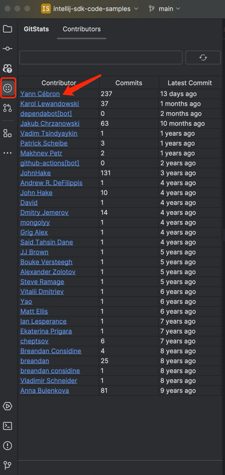
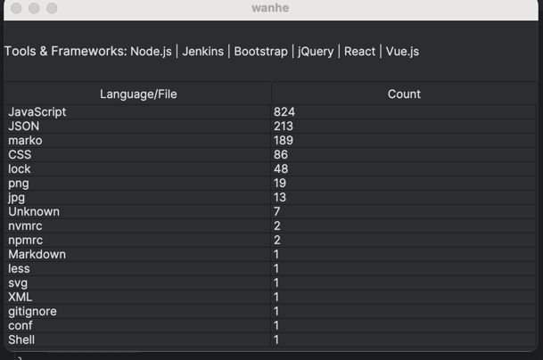

# gitstats-plugin

## tested env
- IntelliJ IDEA 2024.1+
- Mac OS 14.5 (should also work on windows and linux, but not tested)

## Installation

- Manually:

  Download the [latest release](https://github.com/MilkyGreen/gitstats-plugin/releases/latest) gitstats-plugin-0.0.1.zip
   file and install it manually using
  <kbd>Settings/Preferences</kbd> > <kbd>Plugins</kbd> > <kbd>⚙️</kbd> > <kbd>Install plugin from disk...</kbd>

<!-- Plugin description -->

open the gitstats window by right-clicking on the project root directory and selecting `GitStats` from the context menu.

you can see all the contributors and their commits in the project,ordered by recent commits.

you can search for a specific contributor by typing in the search box.

click the refresh button to refresh the latest data.

click contributor name to open a contributor's dialog.

you can see the language and tools used by the contributor in the dialog.

<!-- Plugin description end -->

---
Plugin based on the [IntelliJ Platform Plugin Template][template].

[template]: https://github.com/JetBrains/intellij-platform-plugin-template
[docs:plugin-description]: https://plugins.jetbrains.com/docs/intellij/plugin-user-experience.html#plugin-description-and-presentation
